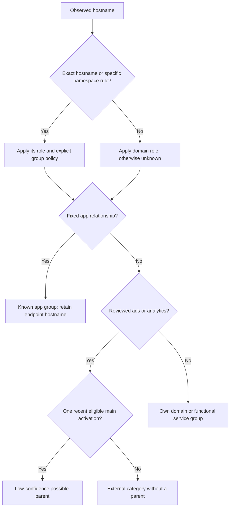

# Domain classification and tentative parent associations

Status: review proposal, 17 September 2026. Only the exact `ios.chat.openai.com → chatgpt.com` rule has been implemented locally. The category and timing policy below is **not loaded by the gateway**.

## Recommendation

Separate **destination identity**, **destination role**, and **possible initiating activity**. For example, an endpoint can be Google-operated analytics, carry an `analytics` badge, and have a low-confidence association with a recent Reddit activation. It must not become Google Search traffic, or acquire a confirmed Reddit label.

Use timing for reviewed ads/analytics endpoints only. Leave security, sign-in, subscriptions, consent tooling, shared content and cloud infrastructure in separate functional categories. Diagnostics can be an optional second phase. Unknown does not mean tracking.

Every hostname still gets its own registered-domain group without needing an allowlist. An unknown or external service can have its own group without being eligible to act as a **main activity anchor**. This is a new distinction; the old four-service list must not return.

## Evidence reviewed

Snapshot of the active `testing` session (`my1bgf2pm80rytf`), record creation cutoff **2026-09-17 07:03:25 UTC**:

- 661 flows, 628 attribution records, 814 DNS records, 131 stored associations and 7 stored groups, all pages retrieved.
- 558 flows have medium-confidence hostname attribution. Another 70 have low/hidden evidence and 33 had no attribution record at the snapshot; domain classification cannot resolve those 103 flows by itself.
- 507 unique hostnames across attribution, DNS queries and CNAME chains.
- 328 hostnames in 77 domain families outside the current JSON aliases/canonical targets at extraction time, representing 305 attributed flows. Four families are local/resolver housekeeping.
- "Outside the table" does **not** mean "Independent traffic": IKEA, Booli, Polymarket and other ordinary domains already get automatic groups.
- A DNS/CNAME-only hostname is not proof that a connection occurred. The live snapshot is not an atomic database transaction; creation cutoff prevents later inserts entering the review, but counters can advance during retrieval.

For readability, family names in this review use **ICANN domain boundaries**, so `googleapis.com` is one family. The current grouping algorithm uses the full Public Suffix List, including private suffixes: it may create separate groups such as `oauth2.googleapis.com` or `reddit.map.fastly.net`. [The full hostname inventory](hostname-inventory.json) preserves `current_group` alongside the family, counts and CNAME provenance.

## Proposed decision order



Rule precedence should be deterministic: **exact hostname → longest explicit hostname suffix → domain role → supported DNS dependency → optional temporal link → own group**. Exact-role rules can identify a pixel inside an otherwise first-party namespace. Store the winning rule and version with each conclusion.

A DNS dependency is only usable when the stored DNS evidence really connects the queried service to that alias for this client/session/flow. An alias seen elsewhere in the session, a shared IP, reverse DNS or a provider name is insufficient. If an alias has several possible originating services, preserve that ambiguity. `cname_sources` in this review is provenance for investigation, not an automatic runtime mapping.

## Starting timing policy

These are tunable initial hypotheses, not calibrated probabilities:

1. Scope all candidates to the **same client and session**, and consider only activations at or before the external event.
2. A main activation is a **new burst of direct first-party connection starts**, after 30 seconds without such a burst for that group. Continuing streaming bytes, CDN aliases, authentication, diagnostics and trackers cannot keep refreshing the anchor. This remains a network heuristic, not evidence of app foreground state.
3. An external ads/analytics event may use the latest eligible activation within **10 seconds**. If another main activation is within **2 seconds** of it, mark the parent ambiguous rather than selecting an arbitrary winner.
4. Preserve the known tracker hostname and role. Write a separate relationship with **low confidence**, e.g. “Possible Reddit association: this analytics connection began 1.8 s after a Reddit activation.” Do not display 95/100 or call it confirmed.
5. No recursive attribution: a tracker, auth endpoint or CDN cannot itself activate a main track. A background service cannot become the fallback parent indefinitely.
6. Associate the **new connection event or bounded activity burst**, not all future bytes on a long-lived socket. Existing shared connections stay unassigned until burst-level evidence exists. Never move an entire historic connection because another main track later activates.
7. A subsequent visit can create another activation of the same stable domain group. It must not create a second domain track. Store activation IDs separately from group IDs.
8. Known main sites keep their own groups regardless of timing. Discord's gateway cannot become Spotify traffic under this policy.
9. Prefer reviewed explicit tenant rules when warranted (e.g. a documented publisher-specific analytics endpoint). Keep `vendor=Kantar/Piwik` and `role=analytics` even when its caller is known.

This will intentionally miss delayed/batched analytics. Increasing the window recovers some events at the cost of more false parent associations. We should replay controlled app switches before choosing a production default.

## Suggested display

```text
reddit.com                              direct and mapped content
  reddit.com / v.redd.it                 known service/content
  External services — possibly related
    region1.app-analytics-services.com  Analytics · possible · +1.8 s

External services — no supported parent
  o123.ingest.sentry.io                  Diagnostics
  login.microsoftonline.com             Authentication
  www.recaptcha.net                     Bot protection
  fonts.gstatic.com                     Shared fonts

nebius.com                              Cloud/AI service website
backblaze.com                           Storage/backup service website
```

The possible links and timing in this display sketch are illustrative, not observed conclusions. Keep first-party/explicit-content totals separate from inferred external totals and count each byte only once globally. Provide a grouping toggle between destination groups and possible parent activities. A badge should distinguish `Analytics`, `Ads`, `Diagnostics`, `Consent`, `Security`, `Authentication`, `Content/CDN`, `Functional API` and `Unknown`.

A “main activation” indicator should say **network activity began**, not “you opened this app.” Regular background checks can otherwise create misleading parent suggestions.

## JSON sketch

Keep simple alias mappings for deterministic group membership. Add a separate versioned role/association rule set, rather than turning the alias table into a list of guessed tracker owners:

```json
{
  "version": 1,
  "rules": [
    {"match": {"hostname": "ios.chat.openai.com"}, "role": "first_party", "group": "chatgpt.com", "association": "fixed"},
    {"match": {"domain": "app-analytics-services.com"}, "vendor": "Google/Firebase", "role": "analytics", "association": "temporal_candidate"},
    {"match": {"hostname": "firebaseinstallations.googleapis.com"}, "vendor": "Google/Firebase", "role": "installation_identity", "association": "none"},
    {"match": {"hostname": "firebaselogging-pa.googleapis.com"}, "vendor": "Google/Firebase", "role": "diagnostic_transport", "association": "optional_temporal"},
    {"match": {"domain": "googleapis.com"}, "vendor": "Google", "role": "shared_api", "association": "none"},
    {"match": {"domain": "recaptcha.net"}, "vendor": "Google", "role": "bot_protection", "association": "none"}
  ]
}
```

`domain` here is an explicit boundary-aware suffix policy, independent of how the full PSL chooses a display group. `hostname` is exact. Future namespace rules must use explicit `hostname_suffix`; never use substring matching. Group ownership and temporal caller association are separate fields.

## Complete domain-family decisions

All classifications below are proposed defaults. `high/medium/low` describe confidence in the **role classification**, not confidence in an initiating app. “Tentative timing” only makes a destination eligible; it does not attach the domain to the last app permanently. Hostname-level exceptions take precedence.

### Tentative timing

| Domain family | Role | Flows | DNS queries | Confidence | Decision / evidence |
| --- | --- | ---: | ---: | --- | --- |
| `2cnt.net` | audience measurement | 1 | 2 | high | Kantar/BARB audience measurement. se-svt-endpoint suggests an SVT-specific tenant, but the whole domain serves other publishers. [Source](https://bbc.github.io/echo-docs/pages/reporting-barb.html). |
| `amplitude.com` | product analytics | 0 | 2 | high | Product analytics SDK/configuration; eligible for a tentative caller link, not a main activity anchor. A config download does not prove an analytics event was sent. [Source](https://amplitude.com/). |
| `app-analytics-services.com` | app analytics | 6 | 5 | medium | Likely Google/Firebase app analytics. A live TLS certificate contains this domain together with google-analytics.com and app-measurement.com. Service-role classification is inferred, not a claim about payload or ATT state. |
| `app-measurement.com` | app analytics | 2 | 5 | high | Google/Firebase measurement endpoint. Keep provider identity distinct from the app that may have triggered it. [Source](https://github.com/firebase/firebase-ios-sdk/issues/5837). |
| `appsflyersdk.com` | marketing attribution | 2 | 4 | high | AppsFlyer launch/configuration and marketing attribution SDK. May batch events from an earlier activity. [Source](https://dev.appsflyer.com/hc/docs/testing-ios). |
| `content-square.net` | experience analytics | 1 | 2 | high | Contentsquare mobile experience-analytics SDK configuration. Loading config is not itself proof of replay or tracking payload. [Source](https://docs.contentsquare.com/en/csq-sdk-flutter/experience-analytics/troubleshooting/). |
| `customer.io` | customer analytics messaging | 1 | 3 | high | Observed cdp hosts ingest customer/event data for messaging and automation. Classify that namespace, not every Customer.io product interaction. [Source](https://docs.customer.io/). |
| `doubleclick.net` | advertising | 1 | 10 | high | Google ad delivery/serving endpoints; their caller may be another site, not google.com. [Source](https://support.google.com/adsense/). |
| `google-analytics.com` | web analytics | 0 | 8 | high | Google Analytics collection family; classify the destination as analytics and infer caller separately. [Source](https://developers.google.com/analytics/). |
| `googlesyndication.com` | advertising | 1 | 8 | high | Google ad delivery/serving endpoints; their caller may be another site, not google.com. [Source](https://support.google.com/adsense/). |
| `googletagmanager.com` | tag delivery | 0 | 5 | high | Tag-container delivery can support analytics or other tags. A request does not establish which tags executed. [Source](https://developers.google.com/tag-platform/tag-manager). |
| `optimizely.com` | experimentation analytics | 1 | 4 | high | Experimentation/personalization SDK and log endpoints. External analytics/experimentation, not necessarily advertising. [Source](https://www.optimizely.com/). |
| `piwik.pro` | web analytics | 2 | 5 | high | Observed Booli tenant and common Piwik collector. Tenant hostnames can later give stronger hints, but do not map the entire provider to Booli. [Source](https://piwik.pro/). |
| `smadex.com` | advertising | 7 | 9 | high | Programmatic ad delivery/attribution. Observed creatives, pixel and tracking hosts are appropriate soft-parent candidates. [Source](https://smadex.com/faqs/). |

### Optional timing; off initially

| Domain family | Role | Flows | DNS queries | Confidence | Decision / evidence |
| --- | --- | ---: | ---: | --- | --- |
| `appcenter.ms` | app diagnostics | 0 | 6 | high | App Center analytics/diagnostics ingestion, not advertising. Mixed telemetry warrants a separate diagnostic badge. [Source](https://learn.microsoft.com/en-us/appcenter/analytics/). |
| `crashlytics.com` | crash diagnostics | 3 | 2 | high | Firebase crash-reporting infrastructure; may report crashes well after the original app activity. [Source](https://firebase.google.com/docs/crashlytics). |
| `debugbear.com` | performance monitoring | 1 | 2 | high | Real-user performance monitoring asset; do not label it advertising. [Source](https://www.debugbear.com/). |
| `sentry.io` | error performance diagnostics | 3 | 7 | high | Tenant ingest endpoints for errors/performance; keep diagnostics distinct from ads. Collection may be delayed or batched. [Source](https://sentry.io/). |

### Verify before timing

| Domain family | Role | Flows | DNS queries | Confidence | Decision / evidence |
| --- | --- | ---: | ---: | --- | --- |
| `adtrafficquality.google` | ad measurement | 6 | 12 | medium | Likely Google ad-quality/invalid-traffic measurement, inferred from the observed ep1/ep2 hostname family; do not equate it with search navigation. |
| `research-int.se` | audience measurement | 1 | 2 | medium | trafficgateway hostname and Kantar/SIFO association suggest audience measurement. Exact endpoint purpose needs confirmation; propose measurement rather than a broad site alias. [Source](https://www.kantarsifo.se/sites/default/files/reports/documents/sifo_ri_den_nya_miljokonsumenten.pdf). |

### Explicit DNS evidence only

| Domain family | Role | Flows | DNS queries | Confidence | Decision / evidence |
| --- | --- | ---: | ---: | --- | --- |
| `akadns.net` | shared cdn dns | 31 | 41 | high | Akamai DNS/CDN infrastructure. Preserve the endpoint and use the original same-client DNS chain when it uniquely supports a service; never map the whole provider to one app. [Source](https://www.akamai.com/products/edge-dns). |
| `akamai.net` | shared cdn dns | 0 | 4 | high | Akamai DNS/CDN infrastructure. Preserve the endpoint and use the original same-client DNS chain when it uniquely supports a service; never map the whole provider to one app. [Source](https://www.akamai.com/products/edge-dns). |
| `akamaiedge.net` | shared cdn dns | 1 | 9 | high | Akamai DNS/CDN infrastructure. Preserve the endpoint and use the original same-client DNS chain when it uniquely supports a service; never map the whole provider to one app. [Source](https://www.akamai.com/products/edge-dns). |
| `akamaized.net` | shared cdn dns | 0 | 0 | high | Akamai DNS/CDN infrastructure. Preserve the endpoint and use the original same-client DNS chain when it uniquely supports a service; never map the whole provider to one app. [Source](https://www.akamai.com/products/edge-dns). |
| `amazonaws.com` | shared cloud cdn | 0 | 3 | high | AWS hosting/CDN used by unrelated customers; this session includes Reddit, Smadex, Polymarket and Contentsquare-related chains. |
| `azure-api.net` | shared cloud routing | 0 | 0 | high | Azure hosting, API gateways and traffic routing. This session contains Microsoft app traffic and unrelated customer measurement endpoints. [Source](https://learn.microsoft.com/en-us/azure/traffic-manager/traffic-manager-overview). |
| `azure.com` | shared cloud routing | 10 | 29 | high | Azure hosting, API gateways and traffic routing. This session contains Microsoft app traffic and unrelated customer measurement endpoints. [Source](https://learn.microsoft.com/en-us/azure/traffic-manager/traffic-manager-overview). |
| `azurefd.net` | shared cloud routing | 0 | 0 | high | Azure hosting, API gateways and traffic routing. This session contains Microsoft app traffic and unrelated customer measurement endpoints. [Source](https://learn.microsoft.com/en-us/azure/traffic-manager/traffic-manager-overview). |
| `azurewebsites.net` | shared cloud routing | 0 | 2 | high | Azure hosting, API gateways and traffic routing. This session contains Microsoft app traffic and unrelated customer measurement endpoints. [Source](https://learn.microsoft.com/en-us/azure/traffic-manager/traffic-manager-overview). |
| `cloudflare.net` | shared cdn dns | 0 | 4 | high | Observed customer CDN aliases include IKEA, OpenAI, X and Reddit. Do not merge all customers. |
| `cloudfront.net` | shared cloud cdn | 0 | 0 | high | AWS hosting/CDN used by unrelated customers; this session includes Reddit, Smadex, Polymarket and Contentsquare-related chains. |
| `dual-s-msedge.net` | shared microsoft edge | 7 | 7 | high | Microsoft delivery/routing namespaces. Observed chains identify Teams, Skype configuration, SharePoint or management clients; the domain itself is not evidence of tracking. |
| `edgekey.net` | shared cdn dns | 0 | 0 | high | Akamai DNS/CDN infrastructure. Preserve the endpoint and use the original same-client DNS chain when it uniquely supports a service; never map the whole provider to one app. [Source](https://www.akamai.com/products/edge-dns). |
| `edgesuite.net` | shared cdn dns | 0 | 0 | high | Akamai DNS/CDN infrastructure. Preserve the endpoint and use the original same-client DNS chain when it uniquely supports a service; never map the whole provider to one app. [Source](https://www.akamai.com/products/edge-dns). |
| `ln-msedge.net` | shared microsoft edge | 0 | 4 | high | Microsoft delivery/routing namespaces. Observed chains identify Teams, Skype configuration, SharePoint or management clients; the domain itself is not evidence of tracking. |
| `spo-msedge.net` | shared microsoft edge | 0 | 2 | high | Microsoft delivery/routing namespaces. Observed chains identify Teams, Skype configuration, SharePoint or management clients; the domain itself is not evidence of tracking. |
| `t-s1-msedge.net` | shared microsoft edge | 0 | 3 | high | Microsoft delivery/routing namespaces. Observed chains identify Teams, Skype configuration, SharePoint or management clients; the domain itself is not evidence of tracking. |
| `trafficmanager.net` | shared cloud routing | 9 | 12 | high | Azure hosting, API gateways and traffic routing. This session contains Microsoft app traffic and unrelated customer measurement endpoints. [Source](https://learn.microsoft.com/en-us/azure/traffic-manager/traffic-manager-overview). |

### Separate service

| Domain family | Role | Flows | DNS queries | Confidence | Decision / evidence |
| --- | --- | ---: | ---: | --- | --- |
| `approovr.io` | app security | 2 | 4 | high | Approov API/app-security infrastructure; observed attest hostname suggests attestation. No ad/tracker classification. [Source](https://approov.io/blog/strengthen-tls-in-react-native-through-certificate-pinning-ios-edition). |
| `bambuser.com` | video commerce | 3 | 2 | high | Embedded live/shoppable video delivery. Functional third-party content, not an ad/tracker label by default. [Source](https://bambuser.com/). |
| `cookielaw.org` | consent management | 2 | 3 | high | OneTrust consent/privacy SDK and assets. This is functional consent tooling, not evidence of ads or consent being violated. [Source](https://www.onetrust.com/). |
| `googleusercontent.com` | shared user content | 4 | 5 | high | User/profile/content hosting spans Google services and customer applications; no universal parent or tracking label. |
| `ipify.org` | network utility | 1 | 2 | high | Public-IP lookup API; useful to many apps and not inherently ad tracking. [Source](https://www.ipify.org/). |
| `magic.link` | authentication wallet | 3 | 6 | high | Magic wallet/authentication infrastructure. Embedded login/service dependency rather than advertising. [Source](https://magic.link/). |
| `magiclabs.com` | authentication wallet | 1 | 2 | high | Magic wallet/authentication infrastructure. Embedded login/service dependency rather than advertising. [Source](https://magic.link/). |
| `microsoftonline.com` | authentication | 28 | 2 | high | Observed login.microsoftonline.com is Microsoft sign-in. No temporal attachment as an ad/tracker. |
| `one.one` | dns resolver | 4 | 2 | high | one.one.one.one is Cloudflare resolver traffic/endpoint identity. It does not identify a visited application. [Source](https://developers.cloudflare.com/1.1.1.1/). |
| `onetrust.io` | consent management | 1 | 2 | high | OneTrust consent/privacy SDK and assets. This is functional consent tooling, not evidence of ads or consent being violated. [Source](https://www.onetrust.com/). |
| `privacy-center.org` | consent management | 1 | 2 | high | Didomi consent/privacy SDK and API domain. Functional consent infrastructure. [Source](https://developers.didomi.io/api-and-platform/domains). |
| `recaptcha.net` | bot protection | 3 | 2 | high | reCAPTCHA security/risk analysis, not an advertising label. [Source](https://developers.google.com/recaptcha/docs/faq). |
| `revenuecat.com` | purchases subscriptions | 1 | 2 | high | Subscription and in-app purchase backend. It has analytics features, but api.revenuecat.com alone is not sufficient to classify this flow as tracking. [Source](https://www.revenuecat.com/). |
| `tailscale.com` | network service telemetry | 2 | 4 | high | Observed log.tailscale.com is network-service logging. Background VPN/network tooling should not follow foreground app timing. [Source](https://tailscale.com/). |

### Own domain group

| Domain family | Role | Flows | DNS queries | Confidence | Decision / evidence |
| --- | --- | ---: | ---: | --- | --- |
| `backblaze.com` | cloud storage site | 1 | 2 | high | Cloud storage/backup vendor. The observed www host is its website, not proof of a background backup or tracker. [Source](https://www.backblaze.com/). |
| `bitcointicker.co` | main site | 21 | 13 | medium | Observed primary domain, API and updates endpoints form one service family. Do not attach it to another recent app. |
| `booli.se` | main site | 1 | 4 | high | Booli housing service; already gets its own domain group without a lookup entry. [Source](https://www.booli.se/). |
| `ikea.com` | main site | 7 | 8 | high | IKEA shopping/design hosts already form their own registered-domain group. [Source](https://www.ikea.com/). |
| `nebius.com` | cloud compute site | 1 | 2 | high | AI/cloud-compute vendor. Only its bare website hostname is present; there is no basis to call this tracking or infer a particular hosted workload. [Source](https://nebius.com/). |
| `polymarket.com` | main site | 4 | 10 | high | Observed website and trading/data APIs belong to the Polymarket service. |
| `postnord.com` | main site | 1 | 2 | high | Observed PostNord app backend; group by the service, not by the last visited site. |
| `sharepoint.com` | main document service | 3 | 4 | high | Tenant document storage/collaboration. Do not interpret tenant names or shared edge domains as tracker evidence. |
| `tested.com` | content site | 0 | 2 | medium | files.tested.com is a content-delivery-looking hostname. Keep its own group; no attributed flow exists in this snapshot. |

### Decide per hostname

| Domain family | Role | Flows | DNS queries | Confidence | Decision / evidence |
| --- | --- | ---: | ---: | --- | --- |
| `cloud.microsoft` | mixed microsoft apps | 7 | 18 | high | Microsoft SaaS namespace includes Outlook, Office and Teams. Use specific hostnames and DNS provenance, not a blanket tracking label. [Source](https://learn.microsoft.com/en-us/microsoft-365/enterprise/urls-and-ip-address-ranges?view=o365-worldwide). |
| `cloudflare.com` | mixed cdn security | 0 | 7 | high | cdnjs is shared content delivery; challenges is bot protection. Neither is automatically advertising. |
| `ggpht.com` | shared image content | 2 | 2 | medium | Observed yt3.ggpht.com is a candidate YouTube image alias. Do not map all Google image hosting to YouTube; review the exact hostname. |
| `googleapis.com` | mixed apis | 68 | 62 | high | 28 observed hostnames include OAuth, maps, Firebase transport/installations, fonts and opaque APIs. No blanket google.com alias or tracker rule. [Source](https://docs.cloud.google.com/vpc/docs/about-accessing-google-apis-endpoints). |
| `gstatic.com` | shared static content | 11 | 17 | high | Observed fonts, maps and image-thumbnail hosts have different functional roles. Shared static delivery is not inherently tracking. |
| `live.com` | mixed microsoft services | 5 | 6 | high | Observed officeapps.live.com endpoints are Office services. Avoid a broad live.com alias that would also capture other Microsoft products. |
| `microsoft.com` | mixed microsoft services | 10 | 38 | high | Teams communication, Graph API, device management, website traffic and events.data telemetry coexist. The telemetry hostnames need their own role. [Source](https://learn.microsoft.com/en-us/microsoft-365/enterprise/urls-and-ip-address-ranges?view=o365-worldwide). |
| `msidentity.com` | identity and graph api | 1 | 4 | high | Session DNS links login.mso/ak.privatelink to Microsoft sign-in and ags.privatelink to Graph. Treat login as authentication and Graph as functional API. |
| `skype.com` | communication configuration | 3 | 4 | medium | Observed config.edge and emea.cc are communication/configuration infrastructure, including Teams chains. No blanket tracker rule or wholesale Teams alias. |

### Network housekeeping

| Domain family | Role | Flows | DNS queries | Confidence | Decision / evidence |
| --- | --- | ---: | ---: | --- | --- |
| `10.in-addr.arpa` | network housekeeping | 0 | 1 | high | Reverse-DNS/service discovery or encrypted resolver discovery; no app parent. |
| `100.in-addr.arpa` | network housekeeping | 0 | 1 | high | Reverse-DNS/service discovery or encrypted resolver discovery; no app parent. |
| `192.in-addr.arpa` | network housekeeping | 0 | 1 | high | Reverse-DNS/service discovery or encrypted resolver discovery; no app parent. |
| `resolver.arpa` | network housekeeping | 0 | 2 | high | Reverse-DNS/service discovery or encrypted resolver discovery; no app parent. |

### Proposed fixed alias

| Domain family | Role | Flows | DNS queries | Confidence | Decision / evidence |
| --- | --- | ---: | ---: | --- | --- |
| `bcdn.se` | app content alias | 2 | 4 | medium | Propose bcdn.se → booli.se. Booli CDN hypothesis is consistent with the session and public listing examples; primary-source confirmation remains incomplete. No timing rule. |

### Exact override implemented

| Domain family | Role | Flows | DNS queries | Confidence | Decision / evidence |
| --- | --- | ---: | ---: | --- | --- |
| `openai.com` | exact app alias | 2 | 2 | high | ios.chat.openai.com → chatgpt.com is implemented as an exact rule. Other OpenAI hosts retain their domain identity. |

### Unknown; separate

| Domain family | Role | Flows | DNS queries | Confidence | Decision / evidence |
| --- | --- | ---: | ---: | --- | --- |
| `sunbreak.com` | unknown api | 2 | 2 | low | api.sunbreak.com is observed but the product/purpose could not be established from primary sources. Do not guess a tracker category. |

## Specific hostname decisions

These exceptions are why a flat domain→app table is insufficient. The list includes all observed Google API/static/content endpoints and the mixed Microsoft families, plus key exact overrides. Unlisted hostnames inherit their domain-family proposal.

| Hostname | Flows | Proposed role | Action | Confidence |
| --- | ---: | --- | --- | --- |
| `accountcapabilities-pa.googleapis.com` | 7 | authentication security | keep service group | medium |
| `acdcatm.outlook.mira.tm.svc.cloud.microsoft` | 1 | office outlook functional | review explicit office parent | medium |
| `addons-pa.googleapis.com` | 6 | opaque google api | keep unknown service | low |
| `ags.privatelink.msidentity.com` | 0 | microsoft graph api | keep service group | high |
| `ak.privatelink.msidentity.com` | 0 | microsoft authentication | keep service group | high |
| `api-emea.flightproxy.teams.microsoft.com` | 1 | teams communication | review explicit teams group | high |
| `atm.office.mira.tm.svc.cloud.microsoft` | 0 | mixed microsoft apps | split by hostname | high |
| `atm.outlook.mira.tm.svc.cloud.microsoft` | 2 | office outlook functional | review explicit office parent | medium |
| `cdnjs.cloudflare.com` | 0 | shared library cdn | keep service group | high |
| `challenges.cloudflare.com` | 0 | bot protection | keep service group | high |
| `config-edge-skype.ln-0007.ln-msedge.net` | 0 | shared microsoft edge | explicit dns evidence only | high |
| `config.officeapps.live.com` | 0 | office outlook functional | review explicit office parent | medium |
| `config.teams.microsoft.com` | 0 | teams communication | review explicit teams group | high |
| `device-provisioning.googleapis.com` | 2 | installation identity | keep service group | high |
| `encrypted-tbn0.gstatic.com` | 0 | image thumbnails | keep service group | medium |
| `encrypted-tbn2.gstatic.com` | 4 | image thumbnails | keep service group | medium |
| `ep-euno-03-prod-aks.flightproxy.teams.microsoft.com` | 0 | teams communication | review explicit teams group | high |
| `ep-swce-03-prod-aks.flightproxy.teams.microsoft.com` | 0 | teams communication | review explicit teams group | high |
| `eu-mobile.events.data.microsoft.com` | 0 | microsoft diagnostics | optional timing | high |
| `eu-teams.events.data.microsoft.com` | 0 | microsoft diagnostics | optional timing | high |
| `feedback-pa.googleapis.com` | 0 | feedback diagnostics | optional timing | medium |
| `firebaseinappmessaging.googleapis.com` | 0 | messaging | keep service group | medium |
| `firebaseinstallations.googleapis.com` | 7 | installation identity | keep service group | high |
| `firebaselogging-pa.googleapis.com` | 6 | sdk telemetry transport | optional timing | high |
| `fonts.googleapis.com` | 0 | font delivery | keep service group | high |
| `fonts.gstatic.com` | 1 | font delivery | keep service group | high |
| `gateway-eu.az.relay.teams.cloud.microsoft` | 0 | teams communication | review explicit teams group | high |
| `geller-pa.googleapis.com` | 7 | opaque google api | keep unknown service | low |
| `googlehosted.l.googleusercontent.com` | 0 | shared user images content | keep service group | high |
| `graph.microsoft.com` | 1 | microsoft graph api | keep service group | high |
| `growth-pa.googleapis.com` | 1 | opaque google api | keep unknown service | low |
| `gz.gstatic.com` | 0 | shared static resources | keep service group | high |
| `gz0.googleusercontent.com` | 1 | shared user images content | keep service group | high |
| `ios.chat.openai.com` | 2 | chatgpt first party | fixed chatgpt parent | high |
| `iosantiabuse-pa.googleapis.com` | 7 | app security | keep service group | medium |
| `lh3.googleusercontent.com` | 3 | shared user images content | keep service group | high |
| `ln-0007.ln-msedge.net` | 0 | shared microsoft edge | explicit dns evidence only | high |
| `locationhistory-pa.googleapis.com` | 0 | location history api | keep service group | medium |
| `locationhistoryplacedetails-pa.googleapis.com` | 7 | location history api | keep service group | medium |
| `login.microsoftonline.com` | 28 | microsoft authentication | keep service group | high |
| `login.mso.msidentity.com` | 1 | microsoft authentication | keep service group | high |
| `mamservice.manage.microsoft.com` | 4 | mixed microsoft services | split by hostname | high |
| `maps.gstatic.com` | 1 | maps content api | review specific maps group | medium |
| `mobilemaps-pa-gz.googleapis.com` | 4 | maps content api | review specific maps group | medium |
| `mobilemaps.googleapis.com` | 0 | maps content api | review specific maps group | medium |
| `mrodevicemgr.officeapps.live.com` | 0 | office outlook functional | review explicit office parent | medium |
| `notifications-pa.googleapis.com` | 0 | messaging | keep service group | medium |
| `oauth2.googleapis.com` | 3 | authentication security | keep service group | medium |
| `oauthaccountmanager.googleapis.com` | 3 | authentication security | keep service group | medium |
| `odc.officeapps.live.com` | 4 | office outlook functional | review explicit office parent | medium |
| `officeclient.microsoft.com` | 0 | mixed microsoft services | split by hostname | high |
| `ogads-pa.googleapis.com` | 0 | possible ad api | review before timing | low |
| `outlook.cloud.microsoft` | 0 | office outlook functional | review explicit office parent | medium |
| `passbox-pa.googleapis.com` | 1 | opaque google api | keep unknown service | low |
| `people-pa.googleapis.com` | 0 | contacts api | keep service group | medium |
| `peoplestack-pa.googleapis.com` | 0 | contacts api | keep service group | medium |
| `pins.manage.microsoft.com` | 1 | mixed microsoft services | split by hostname | high |
| `play.googleapis.com` | 4 | app store api | keep service group | medium |
| `pub-ent-euwe-10-t.trouter.teams.microsoft.com` | 0 | teams communication | review explicit teams group | high |
| `roaming.officeapps.live.com` | 1 | office outlook functional | review explicit office parent | medium |
| `robinfrontend-pa.googleapis.com` | 1 | opaque google api | keep unknown service | low |
| `se-prod.asyncgw.teams.microsoft.com` | 0 | teams communication | review explicit teams group | high |
| `securitydomain-pa.googleapis.com` | 0 | authentication security | keep service group | medium |
| `self.events.data.microsoft.com` | 0 | microsoft diagnostics | optional timing | high |
| `shed.outlook.acdc.tm.svc.cloud.microsoft` | 4 | office outlook functional | review explicit office parent | medium |
| `ssl.gstatic.com` | 1 | shared static resources | keep service group | high |
| `streetviewpixels-pa.googleapis.com` | 0 | maps content api | review specific maps group | medium |
| `t1.gstatic.com` | 3 | shared static resources | keep service group | high |
| `teams.events.data.microsoft.com` | 0 | microsoft diagnostics | optional timing | high |
| `teams.microsoft.com` | 2 | teams communication | review explicit teams group | high |
| `titles.prod.mos.microsoft.com` | 0 | mixed microsoft services | split by hostname | high |
| `www.googleapis.com` | 2 | shared google api | keep service group | high |
| `www.gstatic.com` | 1 | shared static resources | keep service group | high |
| `www.microsoft.com` | 1 | mixed microsoft services | split by hostname | high |
| `youtubei.googleapis.com` | 0 | youtube content api | review fixed youtube parent | medium |
| `yt3.ggpht.com` | 2 | youtube content api | review fixed youtube parent | medium |

## Existing mappings that need role exceptions

The new policy must also inspect already grouped hosts. A vendor-owned tracker is not proof that the vendor's app was opened.

| Rule to revisit | Role | Proposal |
| --- | --- | --- |
| `slackb.com` | first party diagnostics | retain known slack parent; never create a main activation |
| `ads-twitter.com` | advertising | external timing candidate; do not assume foreground X usage |
| `sc-static.net` | ad pixel delivery | external timing candidate; do not assume foreground Snapchat usage |
| `tr.snapchat.com` | ad pixel collection | external timing candidate; hostname-specific rule |
| `tr6.snapchat.com` | ad pixel collection | external timing candidate; hostname-specific rule |
| `sc-gw.com` | mixed snap services | classify only pixel-linked hosts; no blanket tracking policy |
| `aet.spotify.com` | possible first party telemetry | keep Spotify identity; no main activation; role needs confirmation |
| `sentry.io` | diagnostics | separate category; optional caller timing only |

For example, the old `ads-twitter.com → x.com` mapping describes the operator's service family, but embedded X pixels should be external advertising when suggesting the initiating site. Snapchat pixel hosts need the same treatment. `slackb.com` can retain a known Slack dependency while being excluded from main activations. These changes are **proposals**, not edits to the running classifier.

## Decisions that deserve review first

- Approve the separation between destination role and parent activity; keep all main domains automatic.
- Decide whether diagnostics should remain separate initially (recommended), or participate in optional low-confidence timing associations.
- Review the 10-second freshness / 2-second ambiguity / 30-second reactivation defaults using controlled replay.
- Confirm the Booli CDN hypothesis and publisher-specific Kantar/Piwik namespaces before promoting them to fixed links.
- Identify `api.sunbreak.com`; retain Unknown until the product is known. Internal Google API names marked low confidence should also remain separate.

## Implementation boundaries for the next iteration

Keep deterministic domain membership in the current `flow_associations` path. Do not overwrite those records with a guessed initiating app: the schema currently permits one association per flow, and the shared frontend treats it as membership.

Add separate versioned role conclusions, main-activation events and optional external-parent links. Each parent link should record client/session, flow or activity-burst interval, source activation, competing candidates, rule version, observed time, confidence and explanation. Deterministic grouping stays stable while the UI can optionally project those links under a possible parent. A recording must use evidence and rule versions available at its cursor rather than silently changing when the lookup is edited.

Before enabling the new heuristic, replay controlled cases: two apps activated close together, Spotify streaming while another app opens, repeated visits, tracker connection reuse, late analytics batches, and an unknown main domain. Assert that shared APIs never qualify through a broad provider rule, external services never anchor other services, and global byte totals do not change when the grouping view changes.

## Files and validation

- [decisions.json](decisions.json): 77 family decisions, 76 exact-host proposals, per-family observed hostnames/counts/CNAME provenance, proposed timing defaults and existing rules to revisit. The gateway does not load this file.
- [hostname-inventory.json](hostname-inventory.json): all 507 observed hostnames, including currently accounted-for names. No payload inspection or blocking was performed.
- The extraction checked that every one of the 77 unmatched families has exactly one family decision and that every exact-host proposal refers to an observed hostname.
- The live configuration change is limited to the exact ChatGPT hostname override and the resolver support it requires. Existing mapping/inference/persistence regression tests pass. A backend rebuild/restart is required to use it on the gateway.
