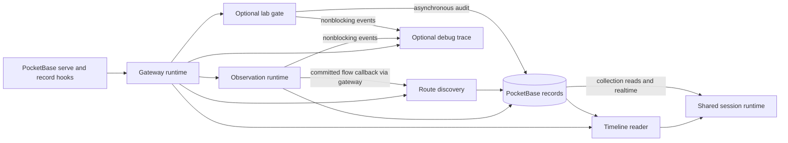

# PocketBase restructuring plan

Original proposal, reviewed 8 October 2026 against commit `ea3ec5f`. The plan below preserves the review findings and intended scope. Implementation is tracked in the [implementation audit](pocketbase-restructuring-progress.md); current boundaries and verification are documented in the [architecture guide](../implementation-guides/pocketbase-architecture.md) and [validation report](../validation/pocketbase-restructuring.md).

Keep PocketBase, the current collections, and the existing features. Simplify the backend by giving each piece of mutable state and each lifecycle operation one owner, deleting unreachable implementations, and concentrating related work behind a few small module interfaces.

The largest opportunity is reducing how much code someone must understand to change one behavior. A file reorganization alone would leave the difficult parts intact: session transitions distributed across workers, repeated database scans, route transactions leaking into scheduling, and compatibility rules repeated across transports.

## Scope and findings

The review covered all tracked production Go under `pocketbase/`, the migration history and test coverage, both command-line tools, shared session-state transport and relevant dashboard consumers, container startup, and the current domain documentation and ADRs. Deployment data and a running Raspberry Pi were not inspected.

There are 114 tracked Go files: 75 implementation/migration files containing 12,840 lines, and 39 test files containing 5,505 lines. The implementation total includes 1,021 migration lines. These are physical line counts, not a complexity score.

| Area | Implementation lines | Assessment |
| --- | ---: | --- |
| Root startup, sessions, timeline, demo and retention | 1,686 | Several unrelated ownership responsibilities in package main |
| Observation, attribution, grouping and destination context | 3,038 | Useful algorithms, but repeated scans and incomplete lifecycle interfaces |
| Route discovery | 2,752 | Necessary evidence/budget rules mixed with scheduling and storage details |
| Lab gate | 2,694 | Mostly necessary traffic-control behavior; some obsolete interface layers |
| Debug trace | 923 | Useful bounded streaming module; preserve its separation from durable audit |
| Network metadata primitives | 294 | A useful shared module with real callers |
| Old proxy helpers in lib and parser | 324 | Unreachable from current executable entry points |
| Migrations and diagnostic commands | 1,129 | Preserve migration history and operational tools |

The system does more than a small capture-and-display loop. Roughly half the non-migration implementation is observation plus route discovery, and another third is the optional gate and trace. Substantial simplification is possible, but an arbitrary percentage reduction would be misleading.

## Functionality to preserve

| Capability | Required behavior |
| --- | --- |
| Passive gateway | Normal NAT forwarding; no TLS interception; participant traffic only; gateway probes, admin traffic and infrastructure traffic excluded |
| Flow observations | TCP/UDP/ICMP conntrack observations, canonical tuple identity, directional counters, sampled lifetimes, accounting diagnostics, unchanged-flow heartbeat and clear suppression until existing tuples disappear |
| DNS observations | Existing dnsmasq formats, query serials, CNAME chains and terminal answers, cache replies, bounded recent-query matching, log rotation/truncation and reconnect behavior |
| Hostname attribution | Same-client DNS evidence matched to flow start; five-minute lookback and existing small after-start tolerance; medium/low/hidden confidence; explanations and no evidence downgrade |
| Domain grouping | Stable client/session/registered-domain groups, explicit aliases and exact-host overrides, IDNA/Public Suffix List behavior, independent uncertain traffic, original hostname preserved |
| Packet activity | Header-only Linux capture; sparse directional activity; wire/payload byte counts and packet/flag metadata; bounded queues; generation acknowledgements; pending-flow matching; distinct missing-capture and unmatched-event accounting |
| Destination context | IP identity, provider labels, PTR and optional GeoIP, refresh/failure behavior, current first/last-seen semantics; slow lookups remain separate from capture and route probing |
| Route discovery | Activity prioritization, finite automatic/manual budgets, one physical probe, Scamper and legacy adapters, cancellation, useful-evidence filtering, cache reuse, persistent spending and network invalidation |
| Route replay | Immutable useful revisions, exact endpoint binding, original measurement age, availability-time selection, confirmation/enrichment events and no resurrection of invalidated older paths |
| Sessions and demo | Ordinary recordings, rolling ephemeral sessions, dedicated restart-resumable demo, configurable retention, server clock, demo health and catalogue export |
| Domain catalogue | Aggregate before expiration, idempotent content-revision checkpoints, corrected contributions, bounded examples, manual review fields, retained anonymous aggregate history |
| Dashboard delivery | Existing manifest/window fields, LOD, pagination, record identities, collection reads/realtime, older-gateway fallback and both dashboard consumers |
| Optional trace | Bounded lossy ingress, coalescing, session filtering, sequence replay, gaps, subscriber limits and inert disabled mode |
| Optional gate | Separate flow/strict/DNS modes; selected IPv4 clients; token/origin validation; queue readiness; fail-open overflow/watchdogs/drain; terminal reconciliation; asynchronous audit and audit completeness |
| Operations | PocketBase console and migrations, existing configuration/defaults, clear response, route controls, diagnostics, ARMv7/ARM64 builds and deployment scripts |

Both accepted [ADRs](../adr/0001-metadata-gateway-not-transparent-tls-proxy.md) remain in force, including the [opt-in gate requirements](../adr/0002-opt-in-nfqueue-flow-admission.md). No proposal requires reopening them.

## Proposed structure

Use the existing feature packages wherever they already provide useful depth. Add two substantive modules to replace the application logic currently trapped in package main. Keep internal file splits modest.

```text
pocketbase/
  main.go                 construct PocketBase, register gateway, start CLI
  gateway/
    runtime.go            serve startup, resource ownership, shutdown
    config.go             composed typed configuration
    sessions.go           hooks, observing-session selection, session completion
    maintenance.go        clear and retention coordination
    demo.go               demo policy, health and catalogue integration
    http.go               application route registration and transport adapters
  observer/
    runtime.go            observation lifecycle and committed-flow callback
    dnsmasq.go
    conntrack.go
    attribution.go        replaces correlator naming
    domain_grouping.go    replaces activity.go naming
    destination.go
    packet_activity*.go   capture, aggregation and persistence internals
    domain_catalogue.go
    domain_groups.go + domain_groups.json
    scope.go
  routing/
    coordinator.go        demand scheduling, probe lifetime and publication retry
    budget.go             private admission logic
    storage.go            concrete evidence transactions and record projection
    retention.go          route-specific expiry and cache rules
    reader.go             route history and evidence-event attachment
    policy.go
    probe*.go             existing Scamper and traceroute adapters
    enrichment.go
    diagnostic.go
  timeline/
    reader.go             manifest and window assembly
    query.go              validated window/LOD/cursor input
    activity.go           activity payload decoding and LOD projection
    types.go              existing response contracts
  labgate/                controller, queues, firewall, audit and control routes
  debugtrace/             events, sink, bounded hub and stream protocol
  netmeta/                canonical tuples, header parsing and address policy
  migrations/             existing ordered migration history
  cmd/                    route-diagnose and nfqueue-smoke
```

This is an ownership map, not a requirement to create every listed file immediately. A file should earn its place by keeping one concept together. There is no need to rename the Go module, move every package under `internal/`, or relocate the executable in the same change.



The gateway coordinates lifetimes. The observation module owns observation state. Routing owns route evidence rules. Timeline owns reads and presentation of stored evidence. Lab gate and debug trace retain separate implementations because their failure behavior differs. The observation module emits its own committed-flow value through a callback; the gateway adapts it to routing intake, preserving baseline tagging and commit ordering.

Use concrete Go types for the gateway, timeline reader and PocketBase stores. Keep interfaces at real seams: probe execution, packet/queue inputs, firewall commands and trace/audit sinks. Avoid a generic repository layer, dependency-injection framework, worker registry or event bus.

## Restructuring opportunities

### 1 Delete unreachable implementations and obsolete internal state

**Evidence.** [main.go](../../pocketbase/main.go#L53) still contains `generateDebugData`, `handleConnection` and `pipeTraffic`. No current entry point calls the first two, and there is no proxy listener. All calls into `lib/packet.go` and `lib/sni.go` are within this unreachable helper chain. `parser/parser.go` is an unused duplicate TLS parser; `lib/traceroute.go` contains only a comment. The old route parser in [observer/destination.go](../../pocketbase/observer/destination.go#L239) is used only by its own test.

**Change.** Delete those functions and their private helpers/imports, `lib/`, `parser/`, the unused hostname map/reset calls, and the old observer route types/parser. Remove the corresponding Docker COPY entries. This deletes more than 600 lines before any substantive redesign.

Inside routing, remove unused `Workers`, `FastDeadline`, `probePlan.Quality`, obsolete cache scheduling fields, `repository.budgets`, and `betterSnapshot`. The last helper has only a test caller: its test does not demonstrate protection of the live publication path. In labgate, move the test-only fake queue into test code and remove verified unused helper state.

**Preserve.** `routing/probe.go` is the actively selectable legacy traceroute adapter. Keep it. Keep existing route JSON compatibility and the clear operation's optional handling of pre-existing `packets`/`traceroutes` collections; deleting dead writers does not authorize deleting installation data. Retain compatibility output for any externally exposed status fields even when their internal implementation is obsolete.

**Benefit and validation.** This passes the deletion test: complexity disappears rather than moving to callers. Verify references using tracked files, run Go tests and both Linux builds, and keep historical-data fixtures. Ordinary `rg` currently misses some tracked frontend `data/` directories because of the broad ignore rule.

### 2 Give startup and session lifecycle one owner

**Evidence.** [main.go](../../pocketbase/main.go#L34) contains global active-session, sampler and routing state. Trace, audit and gate resources start [before PocketBase serve](../../pocketbase/main.go#L119); the gate factory can prepare firewall rules before `app.Start()`. Session completion performs gate disarm and audit flushing inside a record hook. Shutdown is implemented in both defers and the termination hook.

**Change.** Introduce a gateway runtime that owns configuration, the observing-session reference, the observers, routing, trace, gate and GeoIP lifetime. Construction and hook registration are inert. Start external workers/resources only during serve after bootstrap and migrations. Make shutdown one idempotent operation with an explicit completion result.

The session module owns initialization, demo selection, normalization and session transitions. Hooks delegate to it, including changes made through the PocketBase console. Preserve current session selection behavior during extraction. The current schema permits multiple active records even though observation uses one selected ID; adding a uniqueness rule or automatically closing other ordinary sessions would be a separate behavior change.

For session completion, preserve the sequence: release/disarm the applicable gate, flush accepted audit work, capture drop/completeness information, then finalize the session. Perform blocking work outside long database transactions. Publish the new observing-session state after successful record persistence; failed saves must not install an uncommitted session.

For process shutdown, release held packets and stop gate intake before draining audit, stop and join observation/probe workers while persistence remains available, then close trace and shared lookup resources. Bounded drain failures must remain visible.

**Benefit and validation.** One module explains startup, end-session, restart and shutdown. Tests can register the actual application hooks without invoking `main`. Current root tests bootstrap temporary PocketBase and call helpers; they do not exercise the hooks embedded inside `main()`.

### 3 Make clear and retention explicit coordinated operations

**Evidence.** [clearObservationCollections](../../pocketbase/main.go#L392) sets the active-session pointer to nil, suppresses conntrack and resets routing, then retries per-record deletes for up to eight passes. Other workers can already hold an old session ID or queued write. [Ephemeral retention](../../pocketbase/ephemeral_sessions.go#L63) also owns SQL for observation, route, gate, catalogue and shared-cache expiry. Route cache pruning is repeated in [routing/storage.go](../../pocketbase/routing/storage.go#L532), while packet activity has another retention ticker.

**Change.** Give observation and routing explicit reset/quiesce acknowledgement and completion operations. Clear must establish that pre-clear work can no longer commit before deletion begins. Reset DNS references, queued packet work, derivation passes and route results as well as the sampler. A nil session pointer alone is not this guarantee. Use explicit worker acknowledgements and, where work can finish late, a generation checked at the commit seam.

Replace the retry loop only after the relation graph and realtime delete behavior are characterized. Prefer deterministic dependency order and bounded batches. Preserve the current `deleted`/`skipped` response, observation scope, ordinary-session records, catalogue totals and persistent route spending. Bulk SQL is not a drop-in replacement for deletes consumed through PocketBase realtime.

Use one maintenance scheduler with explicit calls into each module's retention implementation. Keep the current different policies: rolling session expiry, inactive-session packet detail, route cache/global suppression expiry and temporary catalogue checkpoints. Route cleanup must run with probing disabled. Consolidate duplicated SQL without silently making their different cutoffs identical.

Within each session cleanup transaction, collect catalogue contributions before removing raw sources. Module retention functions must use the caller's transaction-scoped PocketBase app, so extraction does not split that atomic sweep into separate transactions. Preserve DNS required by retained attributions, live flows, the last pre-window route revision and relevant evidence-event anchors. Shared destinations remain while any recording still references them. Keep set-based rolling deletion and browser age eviction; per-row realtime deletion storms are deliberately avoided here.

**Benefit and validation.** Each module knows how to expire its own records; the gateway knows ordering. Test clear during queued writes, session edits concurrent with cleanup, ordinary-history preservation, engine-off cleanup and bounded growth. Define and test clear-during-armed-gate behavior explicitly before changing it; any transition must remain fail-open. These concurrency corrections should be separate commits from mechanical moves.

### 4 Make the observation module deeper without merging all its workers

**Evidence.** [StartFlowCorrelator](../../pocketbase/observer/correlator.go#L54) loads all session flows and DNS every three seconds. [Grouping](../../pocketbase/observer/activity.go#L46) immediately reloads flows and attributions. Destination enrichment independently reloads flows. Attribution scans the DNS list per flow, and attribution/group synchronization repeatedly looks up and saves individual derived records.

**Change.** Give callers one observation runtime interface rather than five start functions. Its private derivation pass loads one consistent input set: flows, DNS, installed attributions and existing groups/associations. Build a temporary DNS index keyed by client and answer IP. Apply attribution replacement rules, then group using the effective installed attribution, including any stronger existing evidence that rejected a new candidate.

Persist only changed derived fields. Do not equate the existing attribution `materialChange` flag with full equality: it excludes fields such as explanation and observation time. Preserve IDs, required heartbeat writes, timestamps and realtime reconciliation semantics. Begin with the existing cadence and a bounded periodic pass; add persistent dirty tracking only if measurements justify another state mechanism.

Rename internal `activity.go` concepts to domain grouping. Keep the wire/storage names `activity_episodes` and `flow_associations`, stable keys and legacy relationship support. Keep the catalogue's content-revision checkpoints and transactional contribution updates; create-only counters would lose corrections and late DNS answers.

Collapse destination processing's route-key deduplication followed by IP deduplication into one newest-per-IP pass. Feed its separate lookup worker from the shared observation inputs. Preserve its current `last_seen` heartbeat initially; changing it to last flow time affects retention and is a separate semantic decision.

**Benefit and validation.** Attribution and grouping gain locality and fewer database passes without a new messaging system. Compare stored conclusions and stable identities on fixtures covering late DNS, competing names, confidence upgrades/rejected downgrades, aliases, independent traffic and closed recordings. Measure query/save counts for unchanged inputs. Preparse observation CIDRs once while preserving legacy prefix handling.

### 5 Keep packet aggregation isolated from every blocking write

**Evidence.** [packet_activity.go](../../pocketbase/observer/packet_activity.go#L79) correctly separates capture, aggregation and chunk persistence. However, the aggregation loop still writes capture status/windows synchronously and performs retention deletes. Its workers return no flush/join handle. The eleven-argument pipeline function exposes internal queues to tests.

**Change.** Keep one owner of aggregation state, bounded queues, chunk generations and acknowledgement handling. Move status/window persistence to the private writer and retention to maintenance. Encapsulate worker wiring behind the observation runtime. Stop producers, finish bounded accepted work and join before destroying dependencies.

Remove incidental wrappers and atomic variables that have a single owner. Give aggregation a direct pending-expiry operation rather than rebuilding and sorting every dirty snapshot to find one key. Keep genuine concurrency protections and generation checks.

**Benefit and validation.** Callers stop knowing the queue protocol, while capture retains nonblocking behavior. Exercise the interface with synthetic packet input and real temporary PocketBase: packet before flow, events arriving during a write, failed writes, backpressure, late acknowledgements, shutdown and clear. Preserve the distinction between capture loss and unmatched observations; zero observed traffic must remain different from missing evidence.

### 6 Separate route scheduling from transactional evidence rules

**Evidence.** [Coordinator.run](../../pocketbase/routing/coordinator.go#L202) spans about 425 lines and mixes demand, admission, PocketBase reads, probing, enrichment, retries, status and cleanup. It accesses `repo.app` directly despite the nominal repository seam. [publish](../../pocketbase/routing/storage.go#L213) takes independently supplied key, network, session, target, cache, snapshot, state, provenance and time.

**Change.** Keep the small external routing interface and the single scheduling owner. Deepen one concrete route store that owns admission and evidence transactions. Introduce typed internal admission/publication values that carry the endpoint, session, network, method, attempt and probe identity together. Operations should express intent: reserve an attempt, publish its result, bind cached evidence, activate a network, read discovery state and expire evidence.

The coordinator then owns only demand selection, the physical worker lease, cancellation generations and publication retry. It should not know collection names or budget JSON. Read status through one projection rather than repeatedly loading budgets/outcomes on every scheduling tick. Measure before changing reporting cadence.

Keep transaction contents together. Reservation charges session/network budgets and allocates probe identity before launch. Publication atomically handles terminal idempotence, suppression, outcome, accepted observation/route, cache and accounting. Failed publication retries the same result without spending or launching again. Only commit-derived state updates the in-memory cache.

Preserve both real probe adapters, one physical lease until cancelled processes and pipes drain, finite method comparison, visibility/capability pauses and unknown-network behavior. Internally rename obsolete fast/quality terminology around the actual probe method/deadline. Retain the `best` JSON key if renaming the cache's internal retained-snapshot field; do not introduce new ranking behavior by accident.

Move route read/expiry rules into routing so timeline and gateway maintenance call one implementation. Keep the dependency direction from timeline to routing: route reads accept plain validated inputs and return route-page results; timeline owns HTTP inputs, cursors and window assembly. Keep temporal selection, independent route pagination, original measurement age and evidence updates intact.

**Benefit and validation.** One place answers admission and publication questions. Use the real PocketBase store in transaction tests; mock only the probe seam. Preserve concurrency, restart, cancellation, cache and budget tests, and add publication-fails-once/retry-once and delayed-result scenarios through the coordinator interface. Characterize manual primary-method selection, separate manual spending, applicable network/hour/storage limits and finite budget extension before changing admission types.

### 7 Concentrate timeline and compatibility contracts

**Evidence.** [session_timeline.go](../../pocketbase/session_timeline.go#L176) combines request parsing, queries, pagination, record export and activity aggregation. [session_routes.go](../../pocketbase/session_routes.go#L32) attaches route evidence events, while the [frontend collection fallback](../../packages/session-state/src/data/pocketbaseClient.ts#L125) implements the same relationship separately. The 732-line client also contains HTTP, realtime, controls and unused older exports.

**Change.** Expose a timeline reader with manifest and validated-window operations. HTTP handlers translate requests/errors; the reader assembles the existing response. Keep pagination per collection, route anchors, filters, LOD, detail limits and JSON-set queries. Share the versioned activity payload definition/codec at its owning module seam instead of repeating its schema in the writer and reader.

Give route records one typed storage/read projection. Internally distinguish endpoint binding from route ID: evidence events currently put a route ID in a field named `binding_key`. Translate at persistence; a database rename is unnecessary.

Preserve legacy flat hop fields and `alternate_routes`. Map rendering uses flat geography/address fields, while other readers consume structured replies and interface evidence. Normalize old/current representations in one shared frontend route adapter and verify timestamp comparisons using parsed instants.

Split the client behind its existing shared session interface into timeline transport, collection compatibility transport and realtime implementation. Keep the older-gateway fallback; tests explicitly cover it. Remove only exports proven unused across tracked callers. Move generic PocketBase network access from the map volume loader into the shared transport while leaving map-specific aggregation local.

**Benefit and validation.** Most callers depend on one stable session interface. Extend the existing shared JSON-fixture approach to manifests, windows, route revisions/events and gate responses. Exercise both Go output and TypeScript readers. Keep collection/realtime contracts because the map also reads and subscribes directly outside the central session loader.

### 8 Simplify optional lab and trace internals conservatively

**Evidence.** [PacketQueue](../../pocketbase/labgate/types.go#L75) has an optional readiness interface although the real and fake adapters implement readiness. [RuleManager and ModeRuleManager](../../pocketbase/labgate/firewall.go#L31) retain an older flow-only fallback used by a test fake. Controller decision construction and terminal bookkeeping are duplicated. Live versus recorded gate event identities/stages also differ.

**Change.** Require queue readiness and mode-aware rule activation directly, update the fakes and use one controller constructor. Consolidate decision creation and final bookkeeping as private operations. Keep a deliberate nonrecursive degradation/drain path; routing failures through the ordinary terminal path could re-enter failure handling.

Retain the controller actor, queue multiplexer and virtual packet IDs. Keep audit asynchronous and distinct from debug trace: audit records accepted decisions durably and reports loss, while trace is a bounded lossy view. Neither may delay kernel verdicts. Moving the thin trace HTTP integration into gateway code can make the event/hub module independent of PocketBase without adding another abstraction layer.

Specify a stable source identity and phase for live/durable gate events, with compatibility adapters and shared fixtures. Treat this as a follow-up contract correction, not an incidental rename; the current differences establish drift risk, not a demonstrated user-visible failure.

**Benefit and validation.** Fewer optional branches and one owner of decision bookkeeping, with the safety model preserved. Retain tests for all three modes, readiness, tuple isolation, duplicate decisions, terminal cache, watchdogs, overflow, failure drainage, slow subscribers, replay gaps, auth/origin rules and audit loss. Run Linux namespace and Pi acceptance after queue/controller changes.

## Storage and configuration decisions

Keep the existing migration filenames/order and collection names. The first restructuring phases should require no schema migration. Collections separate distinct lifetimes and meanings; reducing their count is not the primary goal.

| Owner | Records and lifecycle |
| --- | --- |
| Gateway sessions | `sessions`; startup, normalization, completion, rolling window and demo policy |
| Observation | `flows`, `dns_queries`, `flow_attributions`, `activity_episodes`, `flow_associations`, packet chunks/windows/status and `destinations`; preserve existing `clients` compatibility/cleanup |
| Route evidence | `routes`, `route_observations`, `route_cache`, `route_outcomes`, `route_budget_state`, `route_evidence_updates` |
| Lab audit | `gate_events` and the session audit-completeness contribution |
| Domain catalogue | `domain_catalogue` and private `_domain_catalogue_checkpoints`; aggregate/checkpoint updates inside the caller's cleanup transaction |
| Timeline | Read-only assembly across these records |

The gateway maintenance operation orders these owners; it does not reimplement their SQL. In particular, route outcomes, historical evidence, cache and spending are not interchangeable. Combining them would make playback and restart limits harder to preserve.

Parse environment configuration once into composed typed values, retaining existing variable names, defaults, aliases, bounds and failure behavior. Keep feature-specific validation in its module. Update Docker build inputs as files move. Replace or retire the stale `install-go.sh` path, which pins Go 1.23 while the module/container pin 1.27.1; document one supported installation path. Correct the root README's obsolete timing-based grouping explanation to match the [current grouping contract](../implementation-guides/domain-grouping.md).

Do not add a shared GeoIP/PTR framework initially. Destination and route lookups have different refresh, provenance and availability rules. A small shared lookup adapter is reasonable later only if duplicated behavior remains after ownership is clarified.

## Implementation sequence

Each step should produce a deployable change. Keep behavior corrections separate from mechanical extraction so reviewers can assess them and rollback stays simple.

| Step | Deliverable | Required acceptance before proceeding |
| --- | --- | --- |
| 0 Characterize | Shared serialization fixtures; tests of registered session hooks and the missing reset/shutdown cases; record baseline query/write counts | Existing ordinary/ephemeral/demo, route, packet and lab behavior specified; suspected defects distinguished from intended contracts |
| 1 Remove remnants | Dead proxy/parser code, obsolete internal state and self-only tests; adjust Docker inputs | No live caller lost; native tests and both Linux builds pass; existing installation data and optional clear handling preserved |
| 2 Extract ownership | Gateway runtime and timeline reader; move existing logic without changing scheduling/SQL | Actual hook tests pass; HTTP/collection contracts and record IDs unchanged |
| 3 Establish lifecycle | Inert construction, serve-only startup, worker completion/reset, explicit clear/session/shutdown ordering | No pre-clear writes recreate data; partial startup cleans up; gate fails open; accepted writes have bounded completion |
| 4 Deepen observation | Shared derivation snapshot, DNS index, exact-difference writes, private packet worker wiring, destination deduplication | Equivalent conclusions/identities and quality; fewer duplicate scans/saves; capture unaffected by writer stalls |
| 5 Deepen routing | Typed admission/publication, store-owned transactions, smaller coordinator, route-owned reads/retention | No extra probes/spend; retry idempotence; old recordings and cache ages preserved; worker lease survives cancellation |
| 6 Consolidate maintenance | One explicit scheduler; module-owned retention; catalogue-before-expiry ordering | Correct anchors/dependencies and ordinary history; bounded rolling storage with routes enabled and off |
| 7 Finish contracts and optional modules | Isolated collection fallback, shared fixtures, lab interface/bookkeeping cleanup, documentation | Both dashboard builds/tests; live/replay compatibility; Linux/Pi gate/probe acceptance |

Steps 4 and 5 are independent once lifecycle ownership is stable. Keep the first implementation scope to steps 0–3. They remove dead code and establish the seam needed for later simplification without coupling it to algorithm changes.

Do not combine this work with a PocketBase upgrade, schema rewrite, replacement realtime transport, a new database, new probe algorithms, changed grouping policy or removal of older-gateway support. Each adds uncertainty unrelated to the requested simplification.

## Verification and rollout

Preserve the strong existing parser, aggregation-generation, route-budget/publication, gate-state and retention tests. Add tests where orchestration currently escapes them rather than reproducing each newly extracted helper.

The highest-value missing scenarios are:

1. A real registered session update/deactivation with gate audit flush, failed save and restart.
2. Clear while DNS answers, packet chunks, attribution passes and route results are in flight; no old generation may repopulate cleared records.
3. Shutdown with dirty chunks, pending audit and a cancelled probe; bounded completion and no use of closed resources.
4. DNS → flow → installed attribution → domain group through the observation interface, including rejected attribution replacement.
5. Publication fails once, retries without another probe/reservation and commits terminal accounting once.
6. Timeline/collection/realtime representations of cached, confirmed, enriched and invalidated routes at the same playback cursor.
7. Rolling cleanup with long-lived flows, pre-window evidence, a disabled route engine, ordinary recordings and catalogue corrections.
8. Serve-only resource startup, partial startup rollback and all fail-open gate transitions.

Use real temporary PocketBase for persistence and hook tests, fixed clocks where practical, and synthetic source/probe/queue adapters for deterministic input. Keep privileged kernel acceptance separate. The existing Linux packet test also needs its `fd00:` scope fixture reviewed against the parser's CIDR requirement before relying on its IPv6 acceptance.

For implementation changes, run the relevant Go and TypeScript suites, race checks for affected concurrency, both dashboard builds, ARMv7/ARM64 compilation, then the existing Linux namespace procedures and Pi validation guides. Preserve the pinned Scamper version/profiles during structural work.

Roll out schema-preserving changes against a stopped-state backup or disposable copy of a real installation. Include an old recorded session, a live session, an ephemeral session, demo catalogue state and gate history. Compare outputs and resource measurements before deployment. Keep the previous image for rollback; any later additive migration needs its own upgrade/rollback test. Do not rewrite historical recordings to adopt current grouping or route formats.

Success means:

- Startup, session transition, clear, retention and shutdown each have one identifiable owner.
- No production globals carry mutable gateway state.
- The observation caller does not know worker queues; the route scheduler does not know collection fields or budget JSON.
- One derivation pass reuses its input records; unchanged derived conclusions cause no redundant saves.
- Route history/read/retention rules have one backend implementation, with compatibility tested across both frontend transports.
- Existing feature contracts and hard resource limits hold under failure, reset and restart.
- A maintainer can answer where a behavior lives without tracing several independently started loops.

Line count will fall through deletion and consolidation, but fewer owners, repeated reads and cross-module invariants are the primary measures of improvement.

## Review validation

- `go test ./...` passed on macOS ARM64.
- `pnpm --filter @infrareveal/session-state test` passed: 7 files, 36 tests.
- Linux ARM64 and ARMv7 `go build ./...` passed with CGO disabled.
- `go test -race ./...` passed on macOS ARM64, including observation, routing, gate and trace.
- Privileged Linux namespace tests, live Raspberry Pi behavior and deployed historical databases were not exercised in this review.
